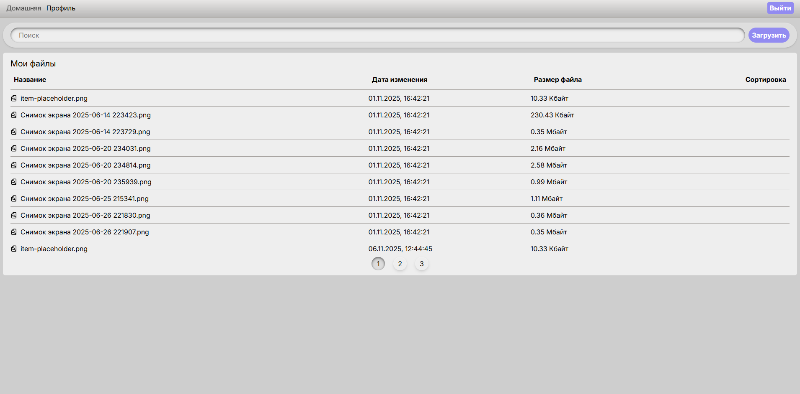

# CloudDrive

## Описание

Клиент-серверное приложение для хранения файлов.

Для авторизации используется JWT.

Авторизовавшись, пользователь может загружать и скачивать свои файлы.

Реализована фильтрация по названию, дате и размеру файла, а также присутствует возможность поиска файла по имени.

## Стэк

- React;
- React Router;
- redux toolkit;
- axios;
- express;
- Postgres;

## Вид сайта

